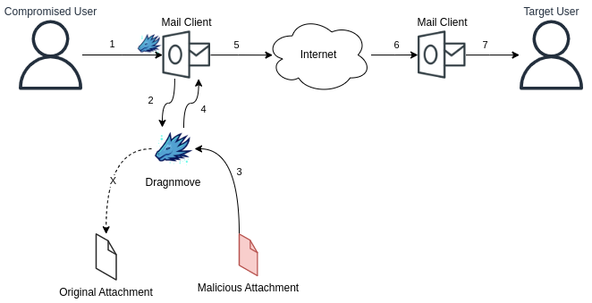

# Dragnmove

Dragnmove is a post-exploitaition tool that infects files shared between users in order to move from one system to another. Dragnmove can detect actions like dropping a file into the browser window or attaching a file to an email client. After Dragnmove detects the action, it hooks CreateFile API calls to modify handles.  

## Usage
- WORK IN PROGRESS!!!
- Change TARGETWINDOW and PAYLOADFILE according to your environment
- Compile Dragnmove with VS2019-VS2022.
- Inject Dragnmove DLL into target process. 

## TODO
- Stabilize tool for different applications
- Create BOF version
- Implement auto infection mechanism

